# 智能建筑能源管理系统

> 基于 Spring Boot 3.2 + Spring AI 1.1 + MCP 架构的智能建筑能源管理系统，通过大模型实现 AI 驱动的建筑能源智能运维。

---

## 项目简介

建筑能耗占社会总能耗的 30% 以上，传统能源管理系统依赖人工巡检和阈值告警，响应慢、误报多、缺乏智能分析能力。本系统通过 **MCP（Model Context Protocol）协议**将建筑能源管理的 27+ 个业务能力标准化暴露给大模型，让 AI 能够自主调用能耗查询、COP 计算、异常诊断、工单管理等工具，实现从"被动监控"到"主动运维"的转变。

### 核心亮点

- **27+ 个 MCP Tool**：覆盖能耗查询、COP 计算、异常诊断、工单管理、事务操作等 9 大业务领域
- **AI 事务操作**：大模型不仅能查询数据，还能创建工单、更新设备状态、调整阈值、关闭告警
- **MySQL 主从复制 + ProxySQL 读写分离**：Master/Slave 主从复制，ProxySQL 中间代理自动路由读写
- **两级异常检测**：第一级快速筛查 + 第二级深度根因分析（4 个假设维度，带置信度评分）
- **三级阈值体系**：设备级 > 建筑级 > 全局级，精细化告警配置
- **COP 能效分析**：基于热力学公式实时计算，结合 RAG 知识库给出专业优化建议
- **SSE 流式对话**：AI 对话实时输出，支持思考过程展示

---

## 技术栈

| 类别 | 技术 |
|------|------|
| 后端框架 | Spring Boot 3.2.5、Spring AI 1.1.4、Spring WebFlux、MyBatis-Plus 3.5.11 |
| AI 大模型 | 阿里通义千问 Qwen-Plus、MCP Server/Client、阿里百炼知识库、百度千帆搜索 |
| 数据存储 | MySQL 8.x 主从复制（Master+Slave）、ProxySQL 读写分离代理、Redis、Redisson 3.26（分布式锁+布隆过滤器）、Caffeine 本地缓存 |
| 微服务通信 | OpenFeign 4.1.5、SSE 流式推送、WebSocket |
| 安全认证 | JWT、Easy Captcha 密码加密 |
| 工具中间件 | EasyExcel 4.0.3、Apache PDFBox、Thymeleaf、Hutool |
| 天气 API | 和风天气 7 天预报 |

---

## 系统架构

系统采用 **MCP Server + MCP Client** 双端架构，MySQL 通过 **ProxySQL** 实现读写分离：

- **McpServer（端口 8014）**：核心业务服务，包含 27+ 个 MCP Tool、定时任务、三级阈值、Redis 缓存
- **UserChatClient（端口 8080）**：管理员端，AI 对话 + MCP Client + Caffeine 本地缓存
- **webapp（端口 9092）**：客户端，能耗看板 + AI 对话 + 工单管理
- **MySQL 主从**：Master（3306）处理写操作，Slave（3307）处理读操作，主从复制实时同步
- **ProxySQL**：应用统一连接 ProxySQL 端口，根据 SQL 类型自动路由读写

---

## 功能展示

### 1. 能耗监控看板

实时监控建筑的电力、水耗、空调能耗、水流量等指标，支持多维度查询和趋势分析。
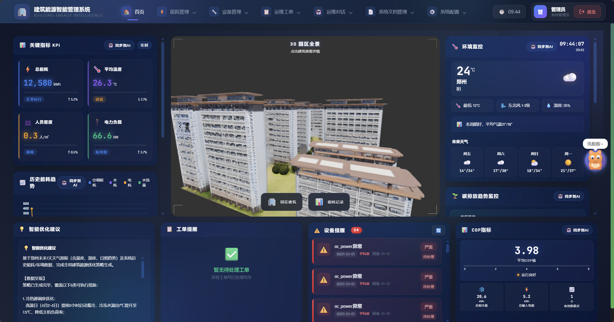


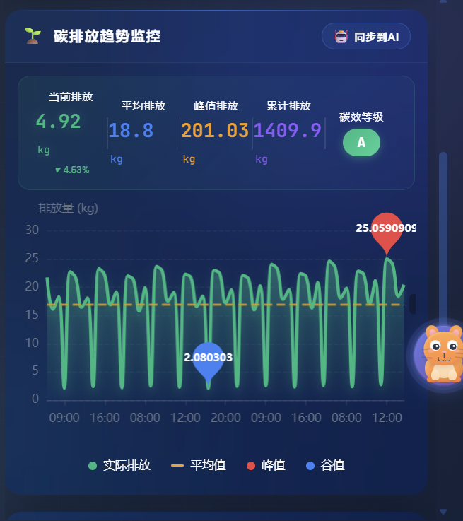
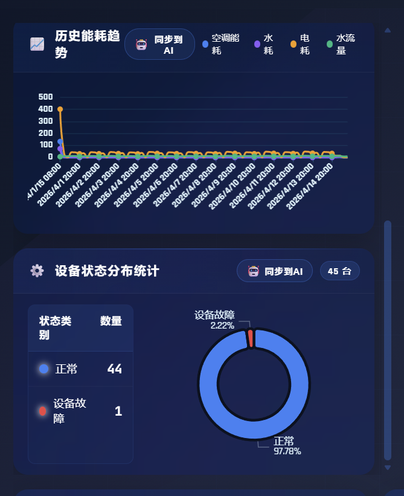
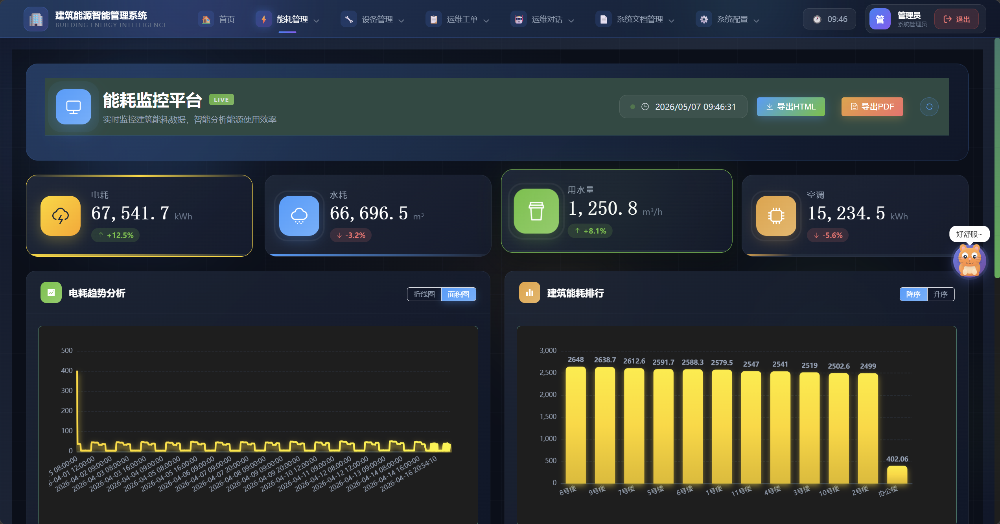
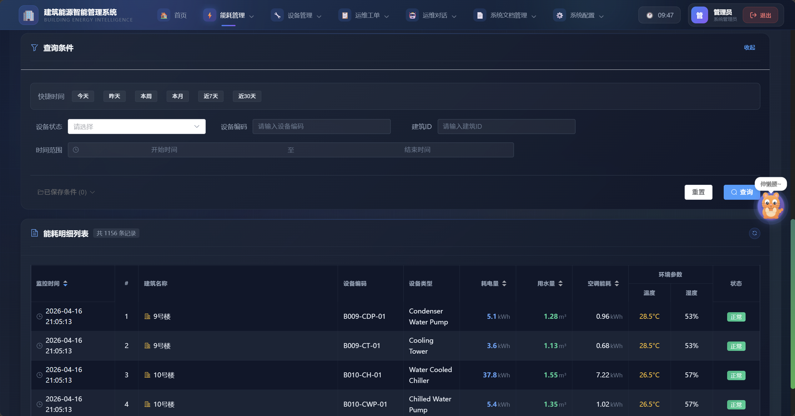


### 2. COP 能效分析

基于热力学公式计算空调系统的 COP（性能系数），评估设备能效水平，诊断效率下降原因。

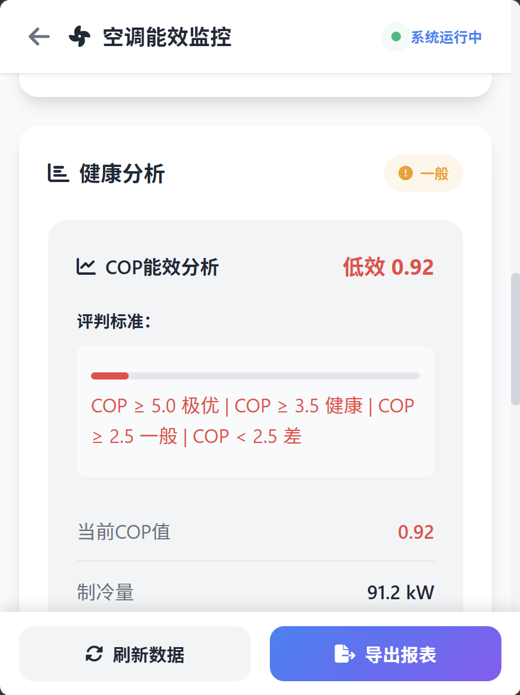

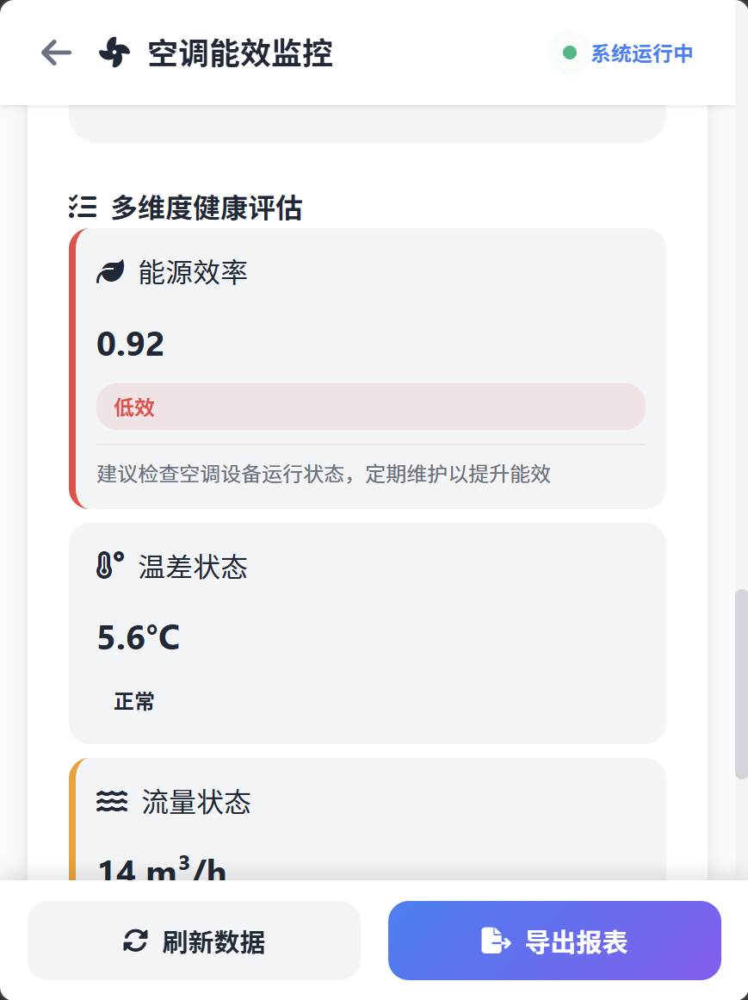

### 3. 智能异常检测

两级异常检测架构：第一级定时任务快速筛查（9 项指标），第二级深度根因分析（温度影响、COP 衰减、人员密度、运行时段）。


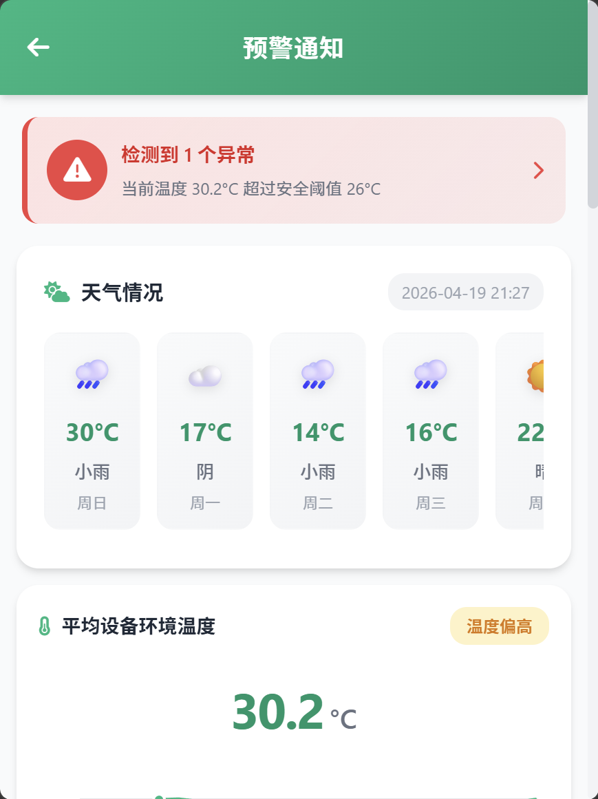


### 4. AI 智能对话

用户通过自然语言与系统交互，AI 自动调用 MCP Tool 获取数据并生成专业回复。支持思考过程实时展示。

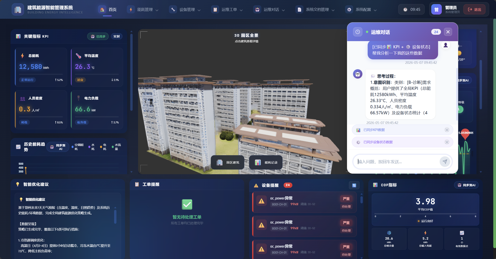

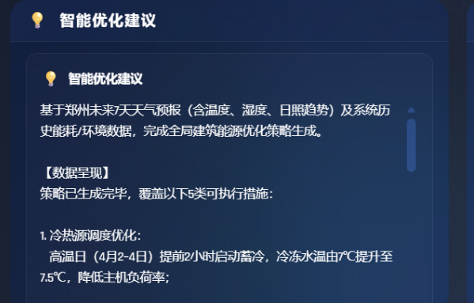


### 5. MCP Tool 选择决策

大模型根据用户意图自动选择最合适的 Tool 进行调用。


### 6. 工单管理

客户端提交设备故障工单，管理员处理工单，支持状态流转（待处理 → 处理中 → 已完成 → 已关闭）和乐观锁防并发。

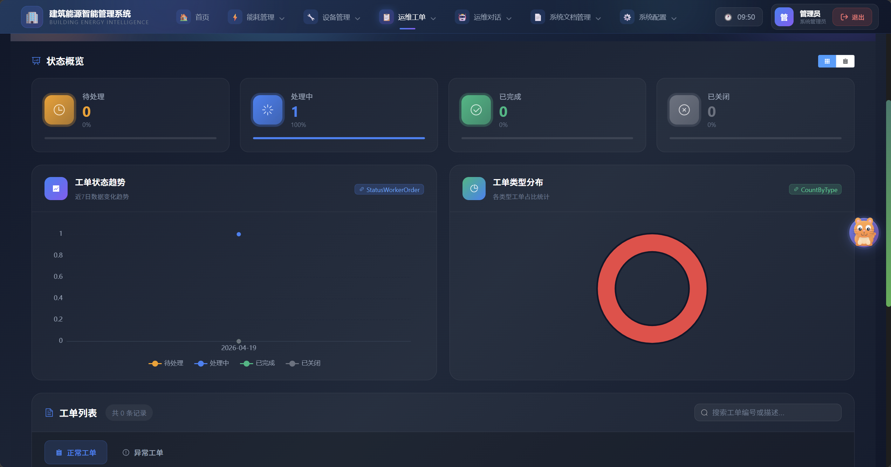


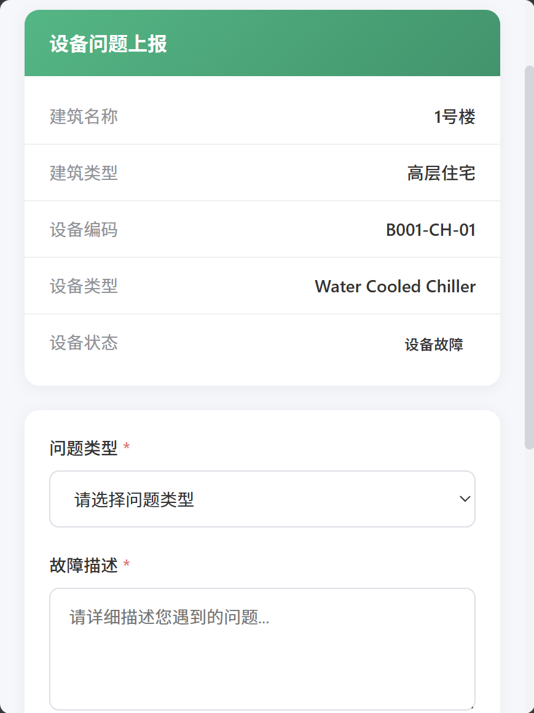
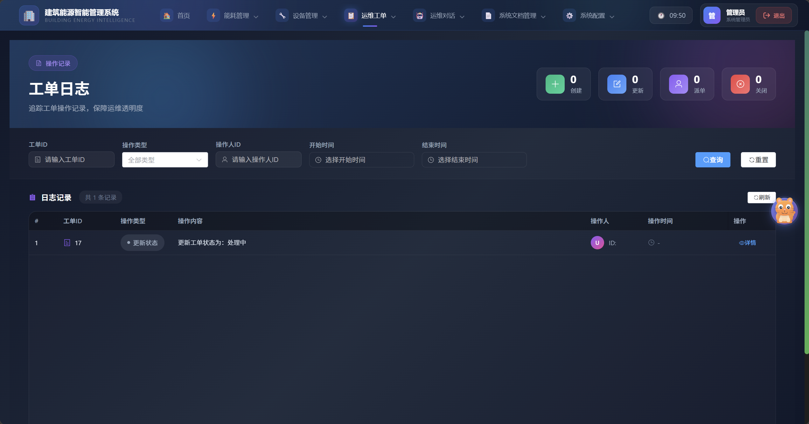
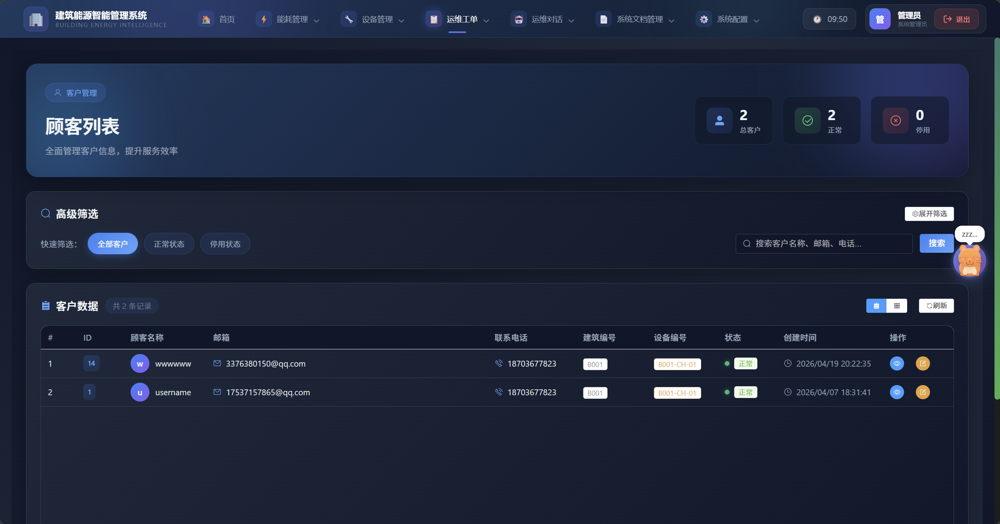

### 7. 告警管理

告警自动创建（每4小时进行异常检测）、自动关闭（设备恢复正常）、告警去重（10 分钟窗口）、告警级别计算（超标 10%/20% 分级）。


### 8. 三级阈值配置

支持设备级、建筑级、全局级三级阈值配置，优先级递减，Redis 缓存加速查询。

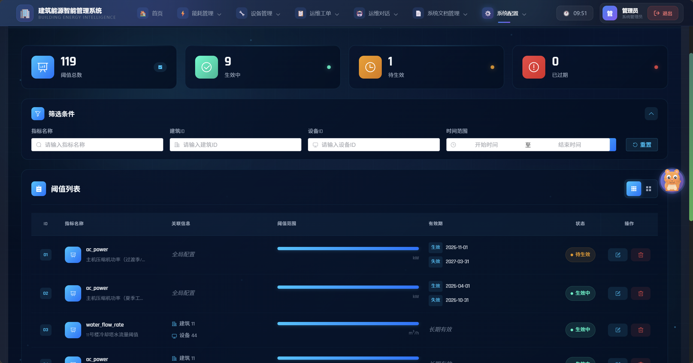


### 9. 设备管理

设备状态监控（正常/故障/维护保养），设备能耗分析，设备异常检测。

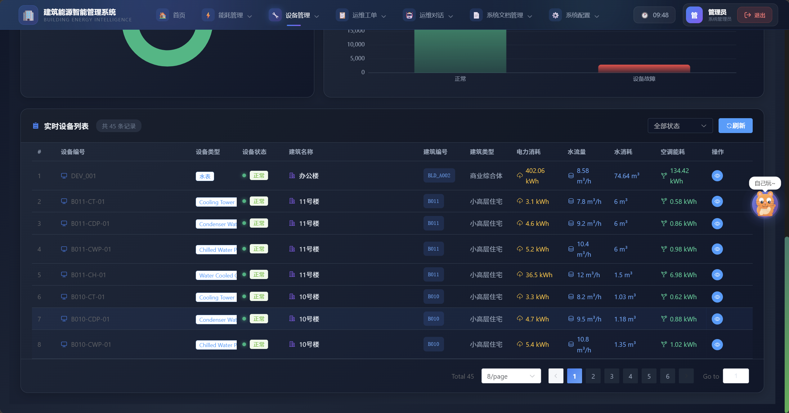
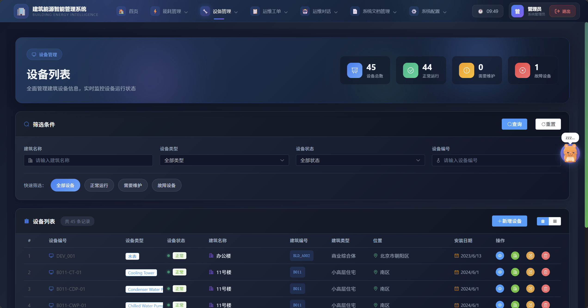


### 10. 知识库管理

支持建筑节能标准、设备使用说明书等 PDF 文档的在线预览和检索。


### 11. 报表分析

多维度能耗报表，支持数据导出。


### 12. 登录注册

支持图片验证码、JWT Token 认证。


---

## 技术亮点

### 线程与并发

| 技术点 | 实现方式 | 解决的问题 |
|--------|---------|-----------|
| SSE 流式推送 | Spring WebFlux Flux | AI 对话实时输出，用户无需等待完整响应 |
| @Async 异步处理 | Spring 异步线程池 | 用户登录时异步触发异常检测 |
| 定时任务线程池 | pool.size=2 | 支持多个定时任务并行执行 |
| ConcurrentHashMap | 反射 Field 缓存 | 避免重复反射调用，提升扫描性能 |
| AtomicBoolean | SSE 标签解析 | 无锁线程安全的状态管理 |

### Redis 缓存策略

```
请求 → Caffeine 本地缓存（3min）→ Redis 分布式缓存（20min）→ MySQL
```

6 类业务数据缓存：阈值配置、设备信息、建筑信息、能耗统计、能耗趋势、会话上下文。

### 分布式锁与并发控制

| 场景 | 实现方式 | 说明 |
|------|---------|------|
| 定时任务防重复 | Redisson RLock | 多实例部署时只有一台执行 |
| 工单并发处理 | MyBatis-Plus 乐观锁 | version 字段防冲突 |
| 数据导入去重 | Redisson 布隆过滤器 | 快速判断是否重复 |

### MySQL 主从复制与 ProxySQL 读写分离

```
应用 → ProxySQL(6033) → Master(:3306, 写) + Slave(:3307, 读)
                          └────── 主从复制 ──────┘
```

| 角色 | 端口 | 职责 |
|------|------|------|
| MySQL Master | 3306 | 接受写操作（INSERT/UPDATE/DELETE），生成 binlog |
| MySQL Slave | 3307 | 通过 IO 线程拉取 binlog，SQL 线程回放，处理读操作 |
| ProxySQL | 6033 | 中间代理，自动将 SELECT 路由到从库，写操作路由到主库 |

应用代码无需感知读写分离，统一连接 ProxySQL 端口即可，由 ProxySQL 根据 SQL 语句自动路由。

### 性能

| 优化项 | 优化前 | 优化后 | 提升 |
|--------|--------|--------|------|
| 异常检测 N+1 查询 | 200 次 DB 查询 | 1 次批量查询 + TreeMap | **200x** |
| 告警去重 N+1 查询 | 50 次 DB 查询 | 1 次查询 + Set 过滤 | **50x** |
| 反射字段访问 | 每次反射 | ConcurrentHashMap 缓存 | **10x** |
| 告警批量插入 | 逐条 insert | saveBatch | **50x** |
| 读写分离 | 所有请求走主库 | ProxySQL 自动路由读到从库 | **~2x** |

---

## 项目结构

```
building/
├── McpServer/                    # 核心业务服务（端口 8014）
│   ├── McpServices/              # MCP Tool 实现（27+ 个）
│   ├── Service/                  # 业务 Service 层
│   │   ├── AnalysisService/      # 异常检测、阈值管理
│   │   ├── CopServiceImpl/       # COP 能效分析
│   │   ├── Opt/                  # 定时任务、异常检测器
│   │   └── WeatherService/       # 天气 API
│   ├── DataBaseController/       # REST 接口
│   ├── Entity/                   # 实体类
│   ├── Mapper/                   # MyBatis Mapper
│   └── McpServiceConfig/         # MCP 配置、缓存配置
├── UserChatClient/               # 管理员端（端口 8080）
│   ├── ChatController/           # SSE 流式对话
│   ├── FeignInterface/           # Feign 远程调用
│   └── RagFlowService/           # 登录认证
├── webapp/                       # 客户端（端口 9092）
│   ├── Chat/                     # AI 对话
│   ├── Database/                 # 业务接口
│   ├── Tool/                     # 本地 MCP Tool
│   └── Service/                  # 业务 Service
└── WebSocket/                    # 实时消息模块（端口 9090）
```

---

## 快速启动

### 环境要求

- JDK 17+
- MySQL 8.x（主库 3306 + 从库 3307，配置主从复制）
- ProxySQL 2.x（读写分离代理，默认端口 6033）
- Redis 6.x+
- Maven 3.8+

### 配置

1. 创建数据库：
```sql
CREATE DATABASE building_energy_standard;
```

2. 配置环境变量（或修改 application.yml）：
```bash
export OPENAI_API_KEY=your_dashscope_api_key
export QWEATHER_API_KEY=your_qweather_api_key
export BAI_DU_API_KEY=your_baidu_api_key
export BAI_DU_SECRET_KEY=your_baidu_secret_key
export accessKey=your_aliyun_access_key
export secretKey=your_aliyun_secret_key
export workspaceId=your_bailian_workspace_id
export indexId=your_bailian_index_id
```

3. 启动服务：
```bash
# 启动 McpServer（端口 8014）
cd McpServer && mvn spring-boot:run

# 启动 UserChatClient（端口 8080）
cd UserChatClient && mvn spring-boot:run

# 启动 webapp（端口 9092）
cd webapp && mvn spring-boot:run
```

---

## MCP Tool 完整列表

| 分类 | Tool 名称 | 功能 |
|------|-----------|------|
| 能耗查询 | `get_device_latest_energy` | 获取设备最新能耗 |
| | `get_building_latest_energy` | 获取建筑最新能耗 |
| | `get_device_energy_range` | 按时间范围查询设备能耗 |
| | `get_building_energy_by_id/name/type/code` | 多种方式查询建筑能耗 |
| COP 计算 | `compute_cop` | 即时 COP 计算 |
| | `diagnose_cop` | COP 诊断 |
| | `diagnose_cop_efficiency` | 增强 COP 诊断 |
| 异常检测 | `smart_analyze_device` | 设备智能分析 |
| | `export_anomaly_report` | 导出异常报告 |
| | `check_abnormal_devices` | 检查异常设备 |
| | `export_abnormal_devices_excel` | 导出异常设备 Excel |
| 设备分析 | `analyze_device_energy` | 设备能耗分析 |
| | `building_optimization_strategy` | 建筑优化策略 |
| 知识库 | `search_knowledge_base` | 阿里百炼知识库搜索 |
| | `search_baidu_baike` | 百度百科搜索 |
| | `search_baidu_web` | 百度网页搜索 |
| 天气 | `get_weather_forecast` | 和风天气 7 天预报 |
| 工单查询 | `countWorkerOrder` | 工单数量统计 |
| | `queryWorkerOrder` | 工单查询 |
| | `queryWorkerOrderLog` | 工单日志查询 |
| **事务操作** | `create_work_order` | **创建工单（事务）** |
| | `update_work_order_status` | **更新工单状态（乐观锁）** |
| | `update_device_status` | **更新设备状态（事务）** |
| | `update_threshold_range` | **更新告警阈值（事务）** |
| | `close_alert` | **关闭告警（事务）** |
| | `batch_close_alerts` | **批量关闭告警（事务）** |
| 系统 | `get_current_date` | 获取当前日期 |
| | `get_current_datetime` | 获取当前日期时间 |
| | `parse_relative_time` | 解析相对时间 |

---

## License

本项目仅供学习交流使用。
